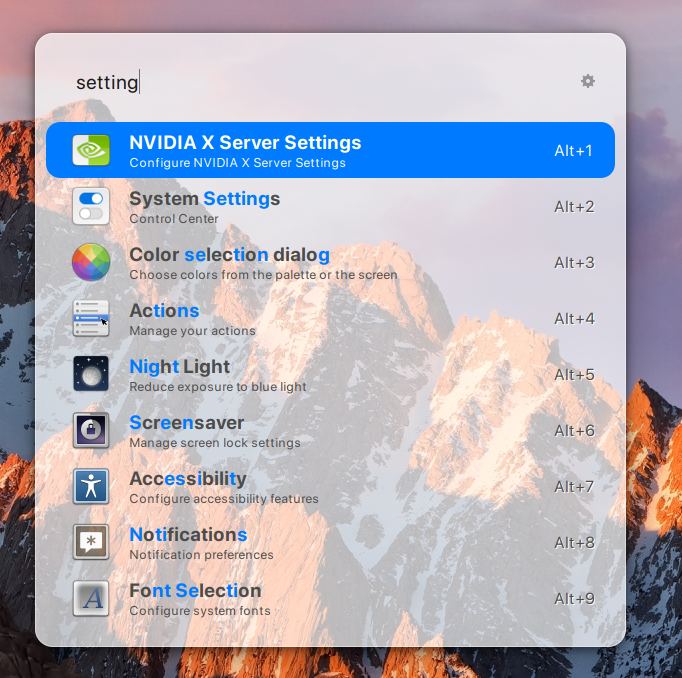
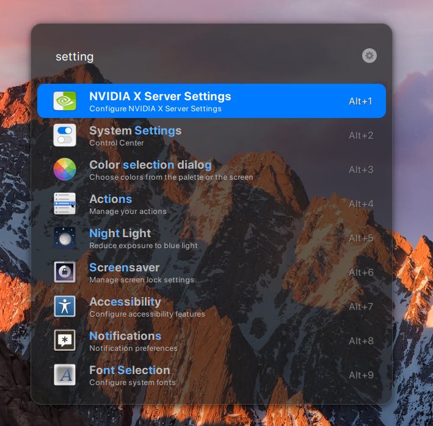

# 🚀 Transparent Themes for Ulauncher

A collection of premium Ulauncher themes inspired by the **macOS Spotlight** aesthetic. Featuring modern *Glassmorphism* (70% transparency with a subtle blue tint) and deep, elegant shadows designed to look perfect on Linux Mint and other GTK-based desktops.

## ✨ Key Features
- **Light & Dark Variants**: Includes both "Trans Light" and "Trans Dark" modes.
- **Blue Tinted Glass**: Authentic macOS-style translucent background with a cool blue hue.
- **Spotlight Shadow**: Multi-layered shadow effects to create a realistic floating window depth.
- **Enhanced Readability**: Optimized text highlighting ensures search keywords remain crisp and white when selected.
- **Cinnamon Optimized**: Specifically tweaked to prevent squared shadow bugs and padding issues in Linux Mint.

## Screenshots
| Light Mode | Dark Blue Mode |
|------------|----------------|
|  |  |

## Project Structure
- `ulauncher-theme-trans-light/`: Transparent light theme with macOS blue accents.
- `ulauncher-theme-trans-dark/`: Deep blue "Dark Tinted Glass" theme.
- `install.sh`: Automated installation script.
- `dark.png` / `light.png`: Theme previews.

## ⚙️ Installation

### Method 1: Automatic (Recommended)
1. Clone this repository or download the ZIP archive.
2. Open your terminal in the project folder.
3. Run the following commands:
   ```
   chmod +x install.sh 
   ./install.sh

### Method 2: Manual Installation
1. Copy the theme folders to your Ulauncher user themes directory:
   ```
   mkdir -p ~/.config/ulauncher/user-themes/
   cp -r ulauncher-theme-trans-* ~/.config/ulauncher/user-themes/
2. Open Ulauncher Preferences -> Appearance.
3. Select Trans Light Blue or Trans Dark Blue from the dropdown menu.

## 🛠 Troubleshooting
If the shadows appear "boxy" or transparency looks off:
- **Shadow Clipping**: Ensure your desktop compositor isn't clipping the window margins. These themes use a large margin (40px) to allow the wide macOS shadow to render correctly.
- **Blur Effect**: While Ulauncher supports transparency, the "blur" effect depends on your Window Manager (like Mutter or Piccolo). It looks best against high-contrast wallpapers.

## 📄 License
This project is licensed under the MIT License.

---
*Crafted with ❤️ for the Linux Mint Community.*
